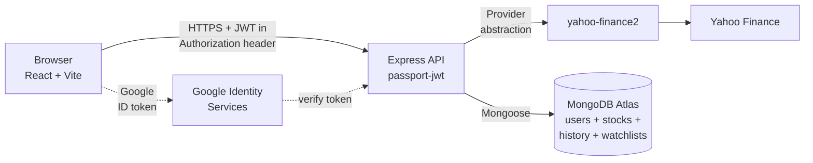
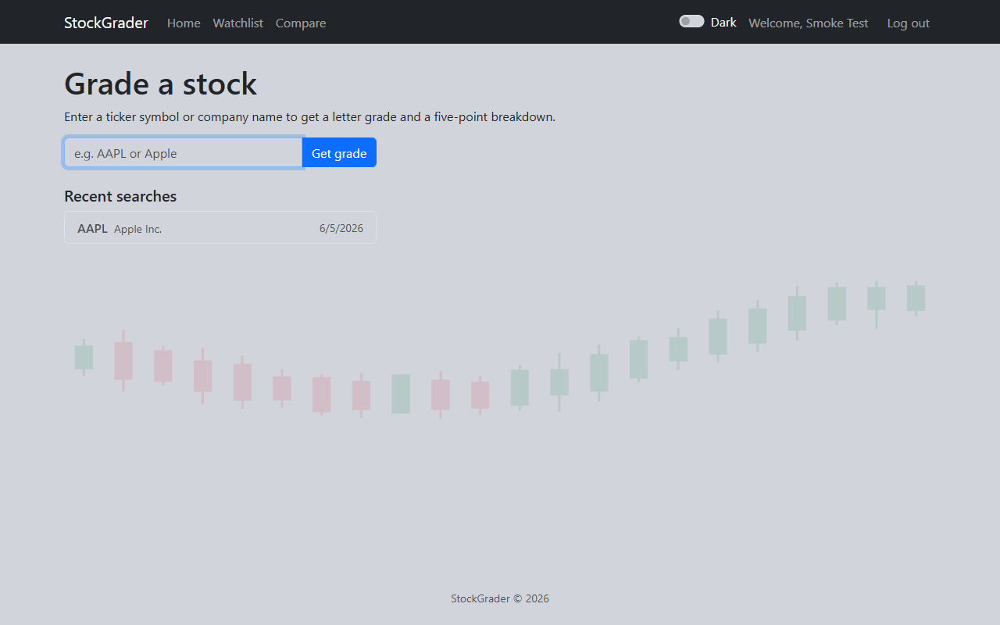
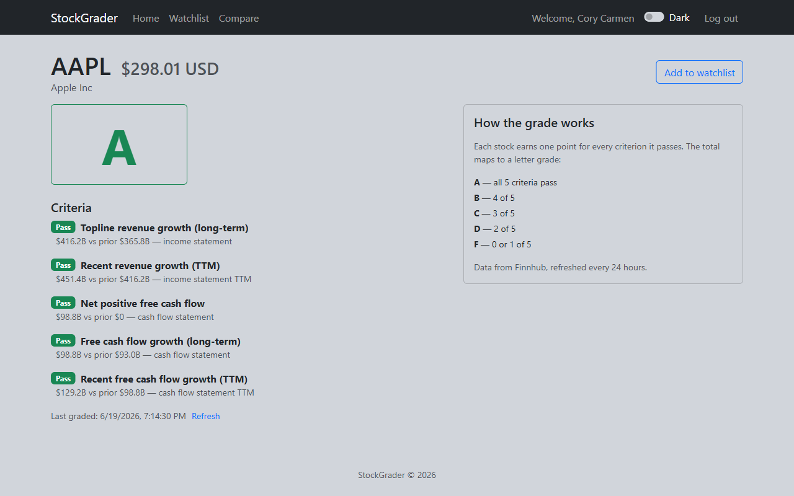
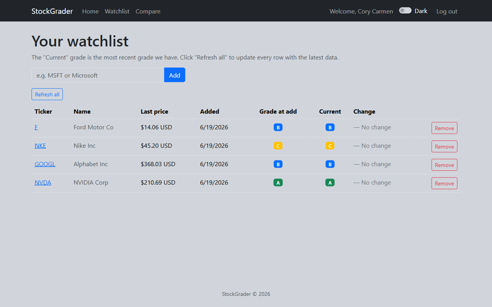
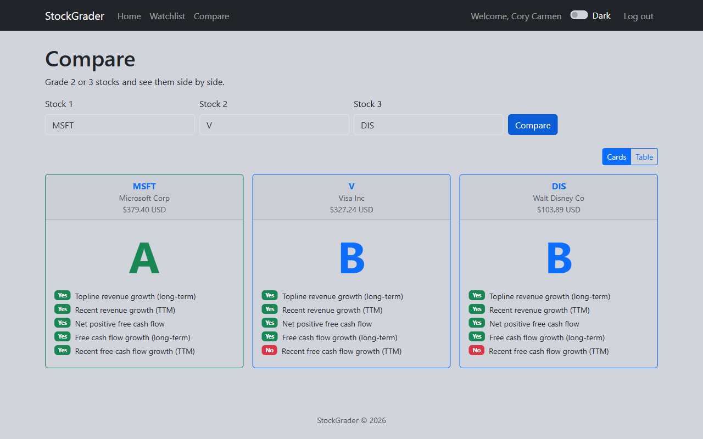
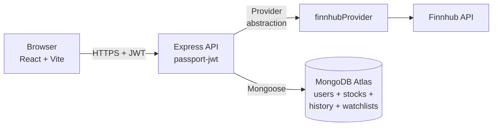

# StockGrader — Development Log

A week-by-week log of building StockGrader, an A–F stock grading app powered by Finnhub fundamentals (originally built on Yahoo Finance — the migration is covered in Week 4). Captures the work done, the obstacles hit, and what was learned along the way.

> **Repos:** [`stock-advisor-frontend`](https://github.com/Cory71/stock-advisor-frontend) · [`stock-advisor-backend`](https://github.com/Cory71/stock-advisor-backend)
> **Live app:** <https://stock-advisor-frontend.vercel.app>
> **Live API:** <https://stock-advisor-backend-j9gw.onrender.com>

---

## Week 1 — Foundation

### What I built

- Wrote the project proposal (problem, audience, MVP feature list, cost estimate). Settled on **StockGrader**: enter a ticker, get an A–F grade plus a five-point breakdown of why.
- Picked the stack: React (Vite) + Bootstrap on the frontend, Express + Mongoose on the backend, Yahoo Finance via `yahoo-finance2` for data, MongoDB Atlas for storage.
- Designed the architecture in Excalidraw (frontend → API → provider → Yahoo, with MongoDB as cache + per-user store).
- Created two GitHub repos (`stock-advisor-frontend`, `stock-advisor-backend`) with `/docs` folders and pushed initial commits.
- Wrote the detailed plan in [`stock-advisor-plan.md`](./stock-advisor-plan.md) including the grading rules, data model, and API surface.

### Challenges

- **Choosing the data source.** Yahoo Finance has no official API. I evaluated `yahoo-finance2` (free, no key, unofficial) against Financial Modeling Prep ($22/mo Starter tier). I went with `yahoo-finance2` for cost but built a `StockDataProvider` abstraction so I could swap in a paid fallback later without touching the grading code.
- **Scope creep risk.** Easy to imagine a hundred features for a finance app. Wrote a tight MVP and pushed everything else into a "Stretch Features" section.

### What I learned

- The value of a thin provider abstraction. Even before I knew Yahoo's API would break (it did, in Nov 2024 — more on that in Week 2), the abstraction kept my options open.
- How to explain a side-project idea concisely. The proposal forced me to answer "who is this for?" in plain English.

### Screenshots / milestones

Architecture sketched in Excalidraw ([`architecture.excalidraw`](./architecture.excalidraw) in this repo); the same shape, rendered inline so GitHub can show it without opening the file:



First commits across both repos — the project's spine, from initial proposal through deployment:

```text
# stock-advisor-frontend
6fe2799  Initial commit: capstone planning and instruction files
d0b90fc  Add Vite + React scaffolding
315869d  Add README and class-by-class plan
4faaa0b  Add React Router, 6 pages, NavBar, and switch auth plan to Passport
9a816b5  Switch auth plan to JWT with Passport-JWT and refresh planning docs
4a86aef  Wire frontend pages with auth, dark mode, name search, watchlist, Compare
683cec0  Add Google sign-in button on Login and Signup pages
03bd204  Add tests, About card, footer, candlesticks, page titles, sticky footer
28c3703  Add Vercel SPA fallback so React Router handles deep links
c39c2a8  Add development log covering Week 1–3 progress

# stock-advisor-backend
d9adbf6  Initial commit: Express scaffolding with cors and dotenv
9e3b030  Add User, Stock, WatchlistItem, and SearchHistory Mongoose models
69cb85e  Add JWT auth with Passport, watchlist CRUD, grading endpoint
d4cf78b  Add name search, price + currency, watchlist grade tracking
5c7c524  Add Google sign-in and password length check
b903d9c  Add API test suite, friendly upstream errors
d518b53  Lock CORS to allowlisted origins in production
```

---

## Week 2 — Backend, Auth, and Grading

### What I built

- Stood up Express with `cors`, `dotenv`, and Mongoose, connected to a MongoDB Atlas cluster (reused an existing `Shopping-App-Cluster` to save on cluster count and made a new `stockgrader` database inside it).
- Built four models: `User`, `Stock` (shared 24-hour cache), `WatchlistItem`, `SearchHistory`.
- Implemented JWT auth with Passport.js (`passport-jwt` strategy). Email + bcrypt password flow. Wrote `register`, `login`, and a protected `/me` route.
- Wrote the **pure grading function** in `lib/grading.js` — five yes/no criteria, score-to-grade mapping, N/A handling for thin tickers. Covered it with 13 Mocha + Chai unit tests.
- Built the Yahoo provider (`providers/yahooProvider.js`) to fetch annual revenue, FCF, and TTM numbers.
- Wired the route handlers: `GET /api/grade/:ticker`, `GET /api/watchlist`, `POST /api/watchlist`, `DELETE /api/watchlist/:ticker`.

### Challenges

- **Yahoo Finance broke in November 2024.** The `cashflowStatementHistory` submodule of `quoteSummary` started returning only `netIncome` — Free Cash Flow disappeared from the response. Took me a while to figure out the workaround: switch to `fundamentalsTimeSeries` with `cash-flow` module, which has `freeCashFlow` directly. Lesson: this is exactly why the provider abstraction mattered. I changed one file.
- **Auth strategy iteration.** I started with raw JWT, briefly switched to Passport sessions, then went back to JWT with `passport-jwt`. After weighing stateless tokens vs server-side sessions for a frontend deployed on a different domain than the backend, JWT was the right call — sessions get awkward fast with cross-origin cookies and CORS credentials. Lesson: figure out where the frontend will live _before_ picking the auth strategy.
- **Cache scoping — shared vs per-user.** My first sketch had graded stocks cached under each user (`{userId, ticker, grade…}`). About halfway through Week 2 I realized the grade for `AAPL` is the same no matter who's asking — the five criteria are universal, the data is universal. So the `Stock` collection became a shared cache keyed only on `ticker` with a 24-hour TTL, and per-user data (watchlist, search history) lives in separate collections. Lesson: caching per-user feels safer but it's wasteful when the underlying answer is identical for everyone.
- **String vs ObjectId mismatch.** The JWT payload stores the user id as a string (because JSON), but Mongoose queries expect MongoDB `ObjectId`s. The first time I tried `WatchlistItem.find({ userId: req.user.id })` it silently returned an empty array because the types didn't match. Fix: let Mongoose coerce by passing the string straight to the schema (it accepts hex-string ids), or explicitly wrap with `new mongoose.Types.ObjectId(id)`. Lesson: silent "no results" is the worst kind of bug — always double-check types when a query feels like it should match but doesn't.

### What I learned

- Pure functions are a gift for testing. The grading function takes data in and returns a grade out — no I/O, no async, no mocks. 13 tests in ~100 lines.
- JWT vs sessions matters more than people say. When your frontend lives on a different domain than your backend (Vercel + Render), sessions get awkward (cookies, CORS credentials). JWT in `localStorage` + `Authorization: Bearer` header just works.
- Manual ticker testing in Postman beats reading docs. I caught the FCF disappearance because I noticed `null` showing up in a real response.

### Screenshots / milestones

Mocha + Chai unit tests on the pure grading function — all 13 green by the end of Week 2 (later joined by the API tests in Week 3, for 50 backend tests total):

```text
  gradeStock — score → grade mapping
    ✔ returns A for 5 yeses
    ✔ returns B for 4 yeses
    ✔ returns C for 3 yeses
    ✔ returns D for 2 yeses
    ✔ returns F for 0 yeses
    ✔ returns F for 1 yes

  gradeStock — individual criteria
    ✔ marks criterion 3 (positive FCF) as passed when latest FCF > 0
    ✔ marks criterion 3 as failed when latest FCF is negative
    ✔ returns 5 criteria for a gradeable input
    ✔ treats missing TTM as N/A for criteria 2 and 5

  gradeStock — N/A handling
    ✔ returns N/A when fewer than 2 annual revenue columns
    ✔ returns N/A when fewer than 2 annual FCF columns
    ✔ returns N/A when no data at all

  13 passing
```

A real successful grade lookup against the live API — built and verified end-to-end in Postman during Week 2 (the live response here is from the deployed backend on Render, hitting the cached AAPL document in MongoDB Atlas):

**Request**

```http
GET /api/grade/AAPL HTTP/1.1
Host: stock-advisor-backend-j9gw.onrender.com
Authorization: Bearer <jwt>
```

**Response — 200 OK**

```json
{
  "ticker": "AAPL",
  "name": "Apple Inc.",
  "price": 311.23,
  "currency": "USD",
  "grade": "B",
  "criteria": [
    {
      "name": "Topline revenue growth (long-term)",
      "passed": true,
      "value": 416161000000,
      "prior": 394328000000,
      "source": "income statement"
    },
    {
      "name": "Recent revenue growth (TTM)",
      "passed": true,
      "value": 451442016256,
      "prior": 416161000000,
      "source": "income statement TTM"
    },
    {
      "name": "Net positive free cash flow",
      "passed": true,
      "value": 98767000000,
      "prior": 0,
      "source": "cash flow statement"
    },
    {
      "name": "Free cash flow growth (long-term)",
      "passed": false,
      "value": 98767000000,
      "prior": 111443000000,
      "source": "cash flow statement"
    },
    {
      "name": "Recent free cash flow growth (TTM)",
      "passed": true,
      "value": 101090746368,
      "prior": 98767000000,
      "source": "cash flow statement TTM"
    }
  ],
  "gradedAt": "2026-06-05T00:29:42.946Z",
  "cached": true
}
```

Score: 4 of 5 criteria passed → **Grade B**. The one failed criterion (long-term FCF growth) is visible in the criteria array, which is what powers the Grade Detail UI checklist.

---

## Week 3 — Frontend, Polish, Tests, and Deployment

### What I built

- Wired the whole frontend: `AuthContext`, `apiFetch` JWT helper, login/signup pages, ticker search, grade detail page, watchlist, compare page (with both Cards and Table views), recent searches on Home.
- Added **dark mode** via Bootstrap 5.3 `data-bs-theme`, persisted to `localStorage`, respecting OS preference on first visit.
- Added **Google sign-in** as a stretch — `google-auth-library` on the backend, `@react-oauth/google` on the frontend, find-or-create user by `googleId` or `email`.
- Polished the watchlist: each row now snapshots the grade at the moment of adding and compares it to the current cached grade (▲ Upgraded / ▼ Downgraded / — No change). Added share price + currency, and column-hiding below 576px so the table fits a phone.
- Added **page-level testing**: backend gained Supertest specs with `mongodb-memory-server` + `sinon`-stubbed Yahoo (37 API tests on top of the 13 grading tests). Frontend gained Vitest + RTL coverage for helpers, components, and hooks (28 tests). Total: **78 tests, all green**.
- Built decorative polish: an upward-trending candlestick band on sparse pages, an "About StockGrader" explainer card beside the form on Login / Signup / logged-out Home, dynamic page titles (`AAPL · StockGrader` instead of every tab saying the same thing), auto-dismissing alerts (5-second `useAutoDismiss` hook), sticky-when-short footer.
- **Deployed**:
  - Backend → Render, with env vars (MONGO_URI, JWT_SECRET, GOOGLE_CLIENT_ID, CORS_ORIGIN, NODE_VERSION=22).
  - Frontend → Vercel, with `VITE_API_URL` pointing at Render.
  - MongoDB Atlas IP allowlist set to `0.0.0.0/0` (Render's free tier doesn't have static outbound IPs).
  - Added the Vercel URL to Google OAuth's Authorized JavaScript Origins.
  - Locked the backend CORS down from `*` to the Vercel origin via the `CORS_ORIGIN` env var.

### Challenges

- **The "Apple" bug.** Typing "Apple" in any search box gave a 404. The route's `TICKER_PATTERN` regex matched any 1–5 letter input, so `APPLE` (5 letters, all caps) was treated as a real ticker — Yahoo doesn't know `APPLE`, only `AAPL`. The fix was a fallback: if `getStockData` fails, try the Yahoo search endpoint with the raw query. Same trap quietly caught `Tesla`, `Cisco`, `Meta`. Lesson: regex feels like a great cheap optimisation until the data lies to it.
- **Test flake from parallel execution.** My Compare-page test asserted "the third ticker errored" but the route runs all three lookups via `Promise.allSettled` — call order isn't guaranteed. The fix was switching from `onCall(N)` to `withArgs('NOPE')`, matching by argument instead of position. Non-deterministic tests are worse than always-failing ones because they pass in CI most of the time.
- **Vercel SPA routing.** First production deploy worked for `/`, but `/signup` and `/grade/AAPL` returned 404 — Vercel served `signup.html` instead of letting React Router take the URL. Fix: a tiny `vercel.json` rewriting every path to `/index.html`. Now deep links and refreshes work.
- **Module imports + sinon stubs.** API tests didn't intercept the Yahoo client at first because each route file did `const { getStockData } = require('../providers/yahooProvider')` — destructuring at require time captures the function reference, which sinon's later `.stub()` can't replace. Changing to namespace imports (`const yahooProvider = require('...')` and `yahooProvider.getStockData(...)`) fixed it.

### What I learned

- **Sticky footers in 4 lines of CSS.** I'd always assumed sticky-when-short, in-flow-when-long was a fancy layout. It's `html, body, #root { min-height: 100vh; } #root { display: flex; flex-direction: column; } main { flex: 1 0 auto; }`. That's it.
- **Tests don't have to slow you down.** The 75-test suite runs in ~10 seconds across both repos. Every time I touched the watchlist resolution code I knew within seconds whether I'd broken something.
- **Real bugs only show in production-shaped environments.** The SPA-routing 404 wouldn't have shown up locally because Vite's dev server already does the fallback. First Vercel deploy = first time the app behaved like a real static-hosted SPA.
- **Cold starts are real.** Render's free tier spins down after 15 minutes — the first request takes 30–60 seconds. Worth noting in the README and in any demo plan.

### Screenshots / milestones

Home page on the live app — search box on the left, "About StockGrader" card beside it (logged-in users see Recent searches instead of the card):



Grade Detail for AAPL — canonical ticker, share price + currency, company name, big letter grade, and the 5-criterion checklist with the actual numbers used:



Watchlist with three rows, each showing the "grade at add" snapshot vs. the current cached grade plus the change column:



Compare page (Cards view) — three stocks side-by-side, with ticker / company / price / grade in each card header and the 5 criteria as Yes/No rows:



Frontend deployed to Vercel:

```text
▲ Production  https://stock-advisor-frontend-k3mbgxaeh-cory71s-projects.vercel.app
  readyState: READY
  target:     production
  Aliased     https://stock-advisor-frontend.vercel.app
```

Backend deployed to Render (excerpt from the Render build log):

```text
==> Running 'npm start'
> stock-advisor-backend@1.0.0 start
> node server.js

Server running on port 10000
MongoDB connected
==> Your service is live 🎉
==> Available at your primary URL https://stock-advisor-backend-j9gw.onrender.com
```

Full test suite — **78 tests passing, all green** (50 backend + 28 frontend):

```text
# Backend  (Mocha + Chai + Supertest)
  50 passing (4s)

# Frontend (Vitest + React Testing Library)
 Test Files  6 passed (6)
      Tests  28 passed (28)
   Duration  3.05s
```

---

## Week 4 — Data Provider Migration, Grading Accuracy, and Polish

### What I built

- Migrated the data source from Yahoo Finance to **[Finnhub](https://finnhub.io/)**. Wrote `providers/finnhubProvider.js` exporting the same `getStockData` / `resolveTicker` shape, so the routes, the grading function, and the tests didn't change — the Week 1 provider abstraction paid off exactly as hoped.
- Added a **`npm run seed`** script that pre-grades ~10 popular tickers into MongoDB from a local machine, warming the shared cache so the deployed backend serves them without a live Finnhub call.
- Hardened the grading pipeline after a systematic sweep of 60+ tickers across every sector:
  - **Date-precise freshness guard** — returns N/A when the most recent annual report is more than ~2 years old (measured from the report's period-end date, so off-calendar fiscal years are handled correctly).
  - **Sector awareness** — banks/insurers/financial firms (no CapEx → no FCF) return N/A with a plain-English reason; REITs, insurers, and utilities that *do* grade carry an amber caveat that free cash flow is only a rough proxy.
  - Surfaced grade explanations to the UI by plumbing a `reason` (for N/A) and `note` (sector caveat) field through the `Stock` model, the routes, and the Grade Detail page.
- Added a **show / hide password** eye toggle (`<PasswordInput />`) to Login and Signup, plus proper `autocomplete` attributes.
- Refined things further after testing the live site:
  - **FCF "growth" must be positive.** Criteria 4 and 5 now require the latest figure to beat the prior period *and* be above zero — so a company that merely shrank a loss (Norwegian Cruise Line, still −$1.2B FCF) no longer earns a passing "growth" check. NCLH went **B → D**.
  - **Friendlier, provider-neutral errors.** A shared `lib/friendlyError.js` maps lookup failures to clean messages across the grade, compare, and watchlist routes. Non-US symbols (e.g. a Toronto `.TO` listing, which the free tier 403s) now show *"StockGrader currently only supports U.S.-listed stocks"* instead of a raw error or a misleading "temporarily unavailable" — and the word "Finnhub" never reaches a user.
  - **Mobile navbar polish.** The collapsed menu now reads as a "Welcome, …" header → page links → divider → theme toggle + log out, instead of those controls floating centered in mid-screen.

### Challenges — the bugs the sweep caught

- **Why migrate at all.** On Render's free tier the backend shares an outbound IP with other tenants, and Yahoo's unofficial endpoints started returning HTTP 429 (rate-limited) in production even though local dev was fine. Finnhub has an official free tier (60 calls/min) with a real API key, which fixed it.
- **Finnhub returns financials as raw XBRL concepts**, and the concept names vary wildly by filer. That caused a string of subtle bugs, each found by eyeballing real numbers in the sweep:
  - **Free cash flow was doubled.** Finnhub reports CapEx as a *positive* amount, but the formula added it (`OCF + capex`) instead of subtracting. Walmart showed $68B FCF instead of ~$15B. Fixed to `OCF − |CapEx|`.
  - **Wrong company entirely.** `financials-reported` maps a ticker to whatever SEC filer historically held it: `GOOG` returned the defunct *Google Inc.* (frozen at 2015), and ticker `B` returned *Barnes Group* — the prior holder of that ticker — not Barrick. Fixed with a symbol alias (GOOG→GOOGL) plus the freshness guard catching the rest.
  - **Revenue grabbed a sub-line.** Pfizer's first matching revenue concept was a $1.8B sub-line; the real total ($62.6B) sat under a different concept. Fixed by taking the *maximum* across all revenue concepts (total ≥ any component). The same fix corrected UnitedHealth ($91B → $447B).
  - **Missing concept variants.** Eli Lilly, Verizon, Realty Income, and Dow each report CapEx under a different us-gaap concept; added each as a fallback.
- **Inconsistent history length.** Finnhub returns anywhere from 4 to 16 years per stock, so "long-term growth" wasn't comparable across companies. Capped grading to the most recent 5 annual periods.
- **The model doesn't fit every business.** Banks, REITs, insurers, and utilities are judged on metrics like FFO, book value, or regulated returns — not free cash flow. Rather than show a confident-but-wrong letter, the app now says so.

### What I learned

- **The provider abstraction was the best early decision.** Swapping the entire data source touched exactly one new file plus import lines — the pure grading function and every existing test were untouched. Worth the small up-front cost back in Week 1.
- **Eyeball real data, not just green tests.** Every unit test stayed green while FCF was silently doubled. The bug only showed when I swept dozens of real tickers and asked "does $68B of free cash flow for Walmart look right?" It doesn't.
- **An honest "N/A" beats a confident wrong answer.** A B for a bank built on meaningless cash-flow numbers is worse than saying "this model doesn't apply here — and here's what to look at instead."

### Screenshots / milestones

Updated architecture — same shape, Finnhub in place of Yahoo:



Full test suite after Week 4 — **102 tests passing** (68 backend + 34 frontend):

```text
# Backend  (Mocha + Chai + Supertest)
  68 passing

# Frontend (Vitest + React Testing Library)
  Test Files  8 passed (8)
       Tests  34 passed (34)
```

---

## Wrap-up

By the end of Week 3 the app was **live, deployed, and tested** — the whole stack (Vercel ↔ Render ↔ MongoDB Atlas ↔ Yahoo Finance) proven end-to-end via a smoke test: sign up on the live site → grade AAPL → see the cached grade with full criteria + price.

**Week 4** then migrated the data source to **Finnhub** (after Yahoo's unofficial endpoints began rate-limiting the deployed backend) and hardened the grading for messy real-world data — so the app now runs on the **Vercel ↔ Render ↔ MongoDB Atlas ↔ Finnhub** stack, with honest N/A handling and sector caveats where free cash flow isn't the right lens.

### Things I'd do differently next time

- Set up the Vercel + Render deployment **earlier**, even with placeholder pages. The two real bugs I found at deploy time (SPA routing + CORS allowlist) would have surfaced sooner.
- Write the devlog **as I go**, not at the end. Some details from Week 1 are fuzzy three weeks later.

### Future improvements (post-capstone)

- Watchlist auto-refresh on a schedule (instead of relying on the user to revisit a ticker's page).
- Sector-relative grading — _true peer comparison_ (e.g. grade a bank against other banks). Week 4 added sector **fit** awareness (N/A for banks/REITs, caveats for utilities); grading a stock relative to its sector peers is still ahead.
- A "Why this grade?" plain-English explanation generated from the criteria. Week 4 took a first step with N/A reasons and sector caveats.
- Email alerts when a watchlist ticker's grade changes.
- Charts of revenue and FCF trends.
