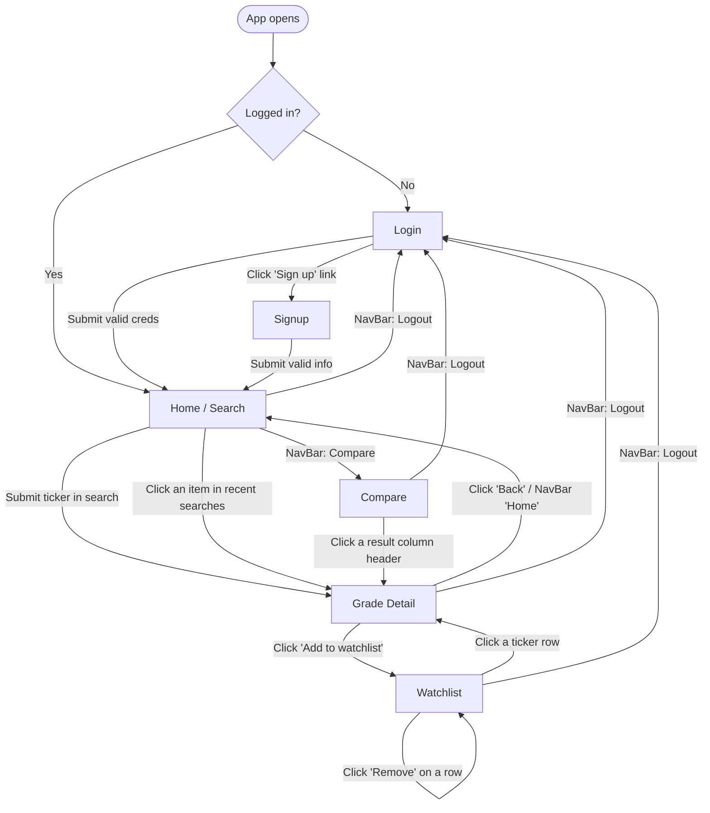

# StockGrader — User Flow and Wireframes

> Visual version: [`wireframes.pdf`](./wireframes.pdf)

Planning artifact for the frontend. Maps every path a user can take through the app, and shows a low-fidelity sketch of every screen.

> The wireframes are deliberately rough — boxes, labels, and notes about behaviour. Visual polish comes from Bootstrap during the build phase, not from these sketches.

---

## User Flow



**Navigation rules:**

- NavBar is visible on every screen.
- When **logged out**, NavBar shows: `StockGrader` (brand) · `Log in` · `Sign up`.
- When **logged in**, NavBar shows: `StockGrader` · `Home` · `Watchlist` · `Compare` · `Welcome, <name>` · `Logout`.

---

## Wireframes

Six screens. For each one: the main element, the actions a user can take, and the four states the instructor requires (happy / loading / empty / error).

### 1. Login `/login`

```
+---------------------------------------------+
| StockGrader                Log in  Sign up  |  <- NavBar
+---------------------------------------------+
|                                             |
|   Log in                                    |
|                                             |
|   [ Error alert (red) — only if failed ]    |
|                                             |
|   Email                                     |
|   [ __________________________________ ]    |
|                                             |
|   Password                                  |
|   [ __________________________________ ]    |
|                                             |
|   [   Log in   ]                            |
|                                             |
|   Don't have an account?  Sign up           |
|                                             |
+---------------------------------------------+
```

- **Main:** Email + password form.
- **Actions:** submit form, click "Sign up" link.
- **States:** *happy* → navigate to Home. *loading* → submit button shows "Logging in…" and disabled. *error* → red alert with backend message. *empty* → N/A.

### 2. Signup `/signup`

```
+---------------------------------------------+
| StockGrader                Log in  Sign up  |
+---------------------------------------------+
|                                             |
|   Sign up                                   |
|                                             |
|   [ Error alert (red) — only if failed ]    |
|                                             |
|   Display name                              |
|   [ __________________________________ ]    |
|                                             |
|   Email                                     |
|   [ __________________________________ ]    |
|                                             |
|   Password                                  |
|   [ __________________________________ ]    |
|                                             |
|   [  Create account  ]                      |
|                                             |
|   Already registered?  Log in               |
|                                             |
+---------------------------------------------+
```

- **Main:** Registration form.
- **Actions:** submit form, click "Log in" link.
- **States:** *happy* → log user in automatically + navigate to Home. *loading* → disabled button. *error* → red alert (e.g. "email already in use"). *empty* → N/A.

### 3. Home `/`

```
+--------------------------------------------------------+
| StockGrader  Home  Watchlist  Compare  [Dark]  Logout  |
+--------------------------------------------------------+
|                                                        |
|   Grade a stock                                        |
|                                                        |
|   Enter a ticker symbol or company name to get a       |
|   letter grade and a five-point breakdown.             |
|                                                        |
|   [ e.g. AAPL or Apple        ] [  Get grade  ]        |
|                                                        |
|   ------------------------------------------------     |
|                                                        |
|   Recent searches                                      |
|                                                        |
|   - MSFT  Microsoft Corporation         2026-06-03     |
|   - AAPL  Apple Inc.                    2026-06-03     |
|   - GOOG  Alphabet Inc.                 2026-06-01     |
|   - ...                                                |
|                                                        |
+--------------------------------------------------------+
```

- **Main:** Ticker-or-name search box.
- **Actions:** submit a ticker or company name → navigate to `/grade/:query`. Click a recent search row → navigate to `/grade/:ticker`. Toggle the NavBar dark-mode switch.
- **States:** *happy* → list of recent searches renders with each row showing ticker + company name + date. *loading* → "Loading…" placeholder. *empty* → "No searches yet — grade your first ticker above." *error* → "Couldn't load recent searches" inline message.

### 4. Grade Detail `/grade/:query`

The URL accepts either a ticker (`/grade/AAPL`) or a company name (`/grade/Apple`); the backend resolves names to the canonical ticker before fetching.

```
+--------------------------------------------------------+
| StockGrader  Home  Watchlist  Compare  [Dark]  Logout  |
+--------------------------------------------------------+
|                                                        |
|   AAPL   $310.61 USD              [Add to watchlist]   |
|   Apple Inc.                                           |
|                                                        |
|   +------------------+                                 |
|   |                  |                                 |
|   |        B         |  <- letter grade, big           |
|   |                  |                                 |
|   +------------------+                                 |
|                                                        |
|   Criteria                                             |
|   [x] Topline revenue growth (long-term)               |
|       latest: $416B   vs earliest: $394B               |
|   [x] Recent revenue growth (TTM)                      |
|       TTM: $451B      vs latest: $416B                 |
|   [x] Net positive free cash flow                      |
|       latest FCF: $101B                                |
|   [ ] Free cash flow growth (long-term)                |
|       latest: $99B    vs earliest: $111B               |
|   [x] Recent free cash flow growth (TTM)               |
|       TTM: $112B      vs latest: $101B                 |
|                                                        |
|   Graded at: 2026-06-03 08:13 (from cache)             |
|                                                        |
+--------------------------------------------------------+
```

- **Main:** Canonical ticker + share price + company name header, letter grade card, 5-criteria checklist with the actual numbers.
- **Actions:** "Add to watchlist" → POST `/api/watchlist` then show inline success/failure alert.
- **States:**
  - *happy* → grade + criteria render.
  - *loading* → spinner with "Grading `<ticker>`…".
  - *empty* → N/A (a query is always specified by URL).
  - *error (logged out)* → friendly info alert: "Please log in to grade stocks" with Log in / Sign up buttons (no scary heading).
  - *error (logged in)* → "Couldn't grade …" red alert.

### 5. Watchlist `/watchlist`

```
+------------------------------------------------------------------------------+
| StockGrader  Home  Watchlist  Compare  [Dark]  Welcome, Cory          Logout |
+------------------------------------------------------------------------------+
|                                                                              |
|   Your watchlist                                                             |
|   The "Current" grade reflects the latest cached grade. To refresh a         |
|   ticker, open its page from the Ticker column.                              |
|                                                                              |
|   Add:  [ e.g. MSFT or Microsoft ] [ Add ]                                   |
|                                                                              |
|   Ticker | Name              | Last price   | Added     | At add | Now | Change       | |
|   ------ | ----------------- | ------------ | --------- | ------ | --- | ------------ | |
|   MSFT   | Microsoft Corp.   | $426.28 USD  | 6/3/2026  |   B    |  A  | ▲ Upgraded   | [Remove] |
|   AAPL   | Apple Inc.        | $310.61 USD  | 6/3/2026  |   B    |  B  | — No change  | [Remove] |
|   TSLA   | Tesla, Inc.       | $228.50 USD  | 6/1/2026  |   B    |  D  | ▼ Downgraded | [Remove] |
|   GOOG   | Alphabet Inc.     | —            | 5/28/2026 |   —    |  C  | — (legacy)   | [Remove] |
|                                                                              |
+------------------------------------------------------------------------------+
```

- **Main:** Table of saved tickers with company name, last cached price + currency, added date, the grade captured at add time, current cached grade, and an upgrade / downgrade / no-change indicator.
- **Actions:**
  - **Add by ticker or name** (POST `/api/watchlist`) — backend resolves names to canonical tickers and freezes the current grade as `gradeAtAdd`.
  - **Remove** a row (DELETE `/api/watchlist/:ticker`).
  - Click the ticker link → navigate to its Grade Detail (this also refreshes the cache, which propagates back to the Watchlist on next load).
- **States:** *happy* → table renders. *loading* → "Loading your watchlist…" *empty* → "Your watchlist is empty. Add a ticker above." *error* → red Bootstrap Alert with the failure reason.

### 6. Compare `/compare`

Two view modes once results have loaded — toggle with the **Cards / Table** buttons.

**Cards view** (default — full breakdown per stock):

```
+--------------------------------------------------------------+
| StockGrader  Home  Watchlist  Compare  [Dark]        Logout  |
+--------------------------------------------------------------+
|                                                              |
|   Compare                                                    |
|   Grade 2 or 3 stocks and see them side by side.             |
|                                                              |
|   Stock 1 [ AAPL ]  Stock 2 [ MSFT ]  Stock 3 [ GOOG ]       |
|                                       [  Compare  ]          |
|                                                              |
|                                  [ Cards ] [ Table ]         |
|                                                              |
|   +-----------------+  +-------------------+  +------------+ |
|   |  AAPL           |  |  MSFT             |  |  GOOG      | |
|   |  Apple Inc.     |  |  Microsoft Corp.  |  |  Alphabet  | |
|   |  $310.61 USD    |  |  $426.28 USD      |  |  $355.50…  | |
|   |       B         |  |        B          |  |     B      | |
|   |---------------- |  |------------------ |  |----------- | |
|   | [x] R1          |  | [x] R1            |  | [x] R1     | |
|   | [x] R2          |  | [x] R2            |  | [x] R2     | |
|   | [x] R3          |  | [x] R3            |  | [x] R3     | |
|   | [ ] R4          |  | [x] R4            |  | [x] R4     | |
|   | [x] R5          |  | [ ] R5            |  | [ ] R5     | |
|   +-----------------+  +-------------------+  +------------+ |
|                                                              |
+--------------------------------------------------------------+
```

**Table view** (criteria as rows, stocks as columns — easier to spot where they differ):

```
+--------------------------------------------------------------+
|                                  [ Cards ] [ Table ]         |
|                                                              |
| Criterion                       | AAPL    | MSFT    | GOOG    |
|                                 | Apple…  | Micros… | Alpha…  |
|                                 | $310.61 | $426.28 | $355.50 |
|                                 |   B     |   B     |   B     |
| ------------------------------- | ------- | ------- | ------- |
| Topline revenue growth (LT)     |  Yes    |  Yes    |  Yes    |
| Recent revenue growth (TTM)     |  Yes    |  Yes    |  Yes    |
| Net positive free cash flow     |  Yes    |  Yes    |  Yes    |
| Free cash flow growth (LT)      |  No     |  Yes    |  Yes    |
| Recent free cash flow growth    |  Yes    |  No     |  No     |
+--------------------------------------------------------------+
```

- **Main:** 2–3 tickers (or company names) compared side-by-side. Toggle between **Cards** (one card per stock with full criteria list) and **Table** (criteria as rows, stocks as columns).
- **Actions:**
  - Type tickers/names + submit → fetch via `GET /api/compare?tickers=…` and render.
  - Click **Cards** / **Table** to switch view.
  - Click any stock's column header (Table) or card header (Cards) → navigate to that ticker's Grade Detail.
- **States:** *happy* → toggle + chosen view render. *loading* → spinner with "Comparing stocks…". *empty* → form sits with defaults until submitted. *error* → if one ticker fails, that single card/column shows the error message; the others still render normally.

---

## Consistency rules across all screens

- **NavBar** is identical on every screen and reflects login state.
- **Primary action button** uses the Bootstrap `primary` variant; destructive actions (`Remove`, `Logout`) use a muted style.
- **Error alerts** are a red Bootstrap `Alert` directly above the form or below the page heading.
- **Loading states** prefer disabling buttons + showing inline spinners over full-page blockers — feels snappier.
- **Empty states** explain *why* the list is empty and what to do next (never just a blank screen).
- **Mobile-first:** every screen should be usable at ~360px wide. The Compare screen stacks columns vertically below ~600px.
